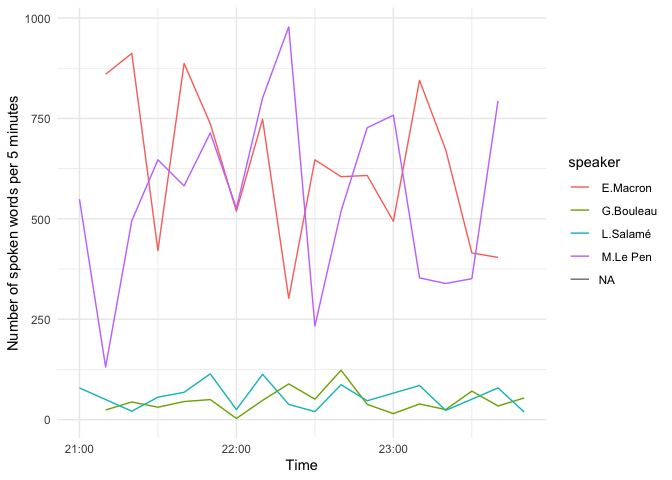

<!-- README.md is generated from README.Rmd. Please edit that file -->

# Transcript of the French presidential TV Debate

This is a provisory transcript of the debate opposing Marine Le Pen and
Emmanuel Macron between the two rounds of the 2022 French presidential
election (April, 21 2022).

I plan on using the replay to fill the missing part soon.

The data was collected live, which explains minor errors in the data:

-   The scraper started collecting data six minutes after the debate
    started
-   The scraper broke twice and did not collected data for periods of 2
    minutes
-   Some sentences are missing, because the subtitle vanished so fast
    that it could not be collected by the scraper

``` r
readr::read_rds("data/2022_debat_second_tour.rds") %>%
  dplyr::glimpse()
#> Rows: 384
#> Columns: 4
#> $ id      <int> 0, 1, 2, 3, 4, 5, 6, 7, 8, 9, 10, 11, 12, 13, 14, 15, 16, 17, …
#> $ text    <chr> "A l'évidence, nous parlons d'une époque où les peurs sont là.…
#> $ stamp   <dttm> 2022-04-20 21:06:08, 2022-04-20 21:06:55, 2022-04-20 21:07:21…
#> $ speaker <chr> NA, " L.Salamé", " M.Le Pen", " G.Bouleau", " E.Macron", " M.L…
```

``` r
readLines("data/2022_debat_second_tour.txt")[1:5]
#> [1] " L.Salamé: Si vous le voulez bien, on va commencer par le 1er thème de ce débat, le pouvoir d'achat. Les prix ne cessent d'augmenter, encore plus depuis le début de la guerre en Ukraine. Les Français le ressentent tous les jours au moment de payer leurs courses, de mettre de l'essence dans la voiture ou de régler la facture du chauffage. M.Le Pen, vous avez la parole. L'inflation risque de s'installer dans la durée. Qu'allez-vous faire pour aider les Français?"                                                                                                                                                                                                                                                                                                                                                                                                                                                                                                                                                                                                                                                                                                                                                                                                                                                                                                                                                                                                                                                                                                                                                                                                                                                                                                                                                                                                                                                                                                                                                                                                                                                                                                                                                                                                                                                                                                                                                                                                                                                                                                                                                                                                                                                                                                                                                                                                                                                                                                                                                                                                                                                                                                                                                                                                                                                                                                                                                                                                                                                                                                                                                                                                                                                                                                                                                                                                                                                                                                                                                                                                                                       
#> [2] " M.Le Pen: Je suis obligée, là encore, d'être la porte-parole des Français. Monsieur Macron, je vous ai entendu, avec votre gouvernement, vous réjouir d'avoir augmenté le pouvoir d'achat des Français. Moi, je n'ai vu que des Français qui m'ont parlé de leurs problèmes de pouvoir d'achat. Je n'ai vu que des Français me dire qu'ils n'y arrivaient plus, qu'ils n'arrivaient plus à boucler leurs fins de mois. 7 Français sur 10 considèrent qu'ils ont perdu du pouvoir d'achat depuis 5 ans. Vous avez fait des choix. Vous avez fait le choix de mettre en place la taxe carbone. Elle a aggravé le prix de l'essence. Vous avez fait le choix de baisser des aides essentielles pour un certain nombre de nos compatriotes, notamment l'aide au logement, de 5 euros. Je veux véritablement faire du pouvoir d'achat la priorité de mon prochain quinquennat, si les Français me font confiance. Par l'intermédiaire de 3 leviers, je le ferai. Je vais d'abord baisser les dépenses contraintes. Je veux proposer de baisser de manière pérenne la fiscalité. Pas avec des chèques, des tickets de rationnement. Je veux le faire de manière pérenne. Je vais baisser la TVA sur l'énergie, l'ensemble de l'énergie, à 5,5 %. Je considère que l'énergie est un bien de première nécessité. Je veux la baisser sur le carburant, le gaz, l'électricité et le fioul. Je vais ainsi rendre 12 milliards aux Français. Je vais aussi leur rendre du pouvoir d'achat par l'intermédiaire de baisses de la fiscalité. Je vais restituer la demi-part fiscale aux veuves et aux veufs. Je souhaite exonérer d'impôt sur le revenu les moins de 30 ans. Je souhaite accorder aux familles une part pleine fiscale dès le 2e enfant, pour augmenter leur pouvoir d'achat de 560 euros par an. Je veux aussi soutenir la valeur travail. C'est mon 2e levier. Il s'agit de revaloriser un certain nombre de catégories, notamment les soignants et les enseignants, qui sont particulièrement maltraités, en dessous de la moyenne européenne. C'est aussi soutenir les alternants, les apprentis, les étudiants qui travaillent, par des compléments de revenus de 200 à 300 euros. Le dernier secteur sur lequel je veux intervenir, ce sont les personnes vulnérables. Pendant votre quinquennat, elles ont été maltraitées. Je veux revaloriser la politique à destination des personnes vulnérables. Je veux donc doubler les allocations pour les familles monoparentales. C'est individualiser aussi l'allocation adulte handicapé. Quand je dis individualiser, c'est la déconjugalisation, pour ceux qui connaissent mal ce système... En réalité, vous avez pris la décision de vous opposer au fait de pouvoir accorder l'allocation adulte handicapé, quel que soit le revenu du conjoint, en créant une dépendance sur une dépendance. Il y a aussi le sujet des retraités, l'indexation des retraites. Elle n'a pas été respectée, c'est le moins que l'on puisse dire, ces 5 dernières années. Voilà véritablement une priorité absolue des 5 prochaines années: restituer aux Français leur argent. L'ensemble de ces mesures permettra de leur rendre en moyenne 150 à 200 euros par mois et par foyer. Bien sûr, pour faire cela, il faut faire des choix. Je fais des choix. Je fais le choix de faire des économies sur des dépenses qui m'apparaissent dispendieuses ou nocives, ce que je considère comme de l'argent qui s'enfuit parce que personne ne s'y est attaqué de manière sérieuse."                                                                                                                                                                                                                                                                                                                                                                                                                                                                                                                                                                                               
#> [3] " G.Bouleau: Vous avez consacré 4 minutes à votre réponse. E.Macron, même question. Qu'allez-vous faire pour aider les Français sur ce point particulier, le pouvoir d'achat?"                                                                                                                                                                                                                                                                                                                                                                                                                                                                                                                                                                                                                                                                                                                                                                                                                                                                                                                                                                                                                                                                                                                                                                                                                                                                                                                                                                                                                                                                                                                                                                                                                                                                                                                                                                                                                                                                                                                                                                                                                                                                                                                                                                                                                                                                                                                                                                                                                                                                                                                                                                                                                                                                                                                                                                                                                                                                                                                                                                                                                                                                                                                                                                                                                                                                                                                                                                                                                                                                                                                                                                                                                                                                                                                                                                                                                                                                                                                                           
#> [4] " E.Macron: Madame Le Pen a raison de dire que les chiffres, qui ne sont pas les miens mais ceux d'organismes indépendants, établissent que le pouvoir d'achat, en particulier celui des Français qui travaillent, les classes moyennes, a augmenté. Mais les chiffres, en moyenne, ne viennent pas aider à finir le mois quand la vie devient plus chère. C'est une réalité. Je partage totalement ce que vous avez dit. J'ai les mêmes retours de mes déplacements sur le terrain. J'en ai fait plus de 600 durant ces 5 dernières années. Il y a une colère, avec les caddies qu'on n'arrive plus à remplir... Ce que nous avons fait, ce que je veux maintenir, c'est que, face aux prix de l'énergie, je veux maintenir le bouclier. Ca consiste à bloquer les prix sur l'électricité et le gaz. C'est 2 fois plus efficace que la baisse de la TVA. C'est pour ça que je me permets de le dire. Les Français auront une augmentation de leur facture de plusieurs dizaines ou centaines d'euros par mois si vous deviez être élue. Vous avez voté contre ce bouclier énergétique. Quand on bloque une augmentation qui est de 40, 60, 100 % pour certaines énergies, on se retrouve avec des chiffres problématiques. La 1re chose, c'est de maintenir ce bouclier aussi longtemps que la crise sera là. C'est un dispositif de crise et je l'assume. C'est la différence avec vous. C'est 2 fois plus efficace que vous. La 2e différence, c'est que ça n'est pas pérenne. Vous l'avez très bien décrit. C'est un dispositif de crise. Quand on reviendra à des prix traditionnels, j'assumerai de ne pas subventionner le gaz et le pétrole qu'on ne produit pas. Je veux plutôt dépenser l'argent public pour aider les ménages pour changer de véhicule ou rénover leur logement. On a commencé à le faire. La 2e chose, c'est le travail. Je suis fier que tous ensemble, nous ayons permis de créer 1,2 million de feuilles de paye. Je regardais votre programme, vos 22 mesures. Il n'y a même pas le mot \"chômage\" dedans. C'est frappant. C'est une reconnaissance du travail bien fait pour les 5 années qui viennent de s'écouler. Je vous en remercie. La meilleure façon de gagner du pouvoir d'achat, c'est de lutter contre le chômage. Nous avons baissé le chômage de plus de 2 points. 1,2 million de Français ont retrouvé un travail. Je veux aller plus loin. Le Smic sera augmenté de 34 euros par mois. Même chose pour les plus petites rémunérations dans la fonction publique, avant la reprise du point d'indice à l'été. Les retraites moyennes seront augmentées d'environ 60 euros par mois pour une retraite de 1400 euros. On ne va pas attendre le 1er janvier prochain. Là, on a une inflation à plus de 4 %. Pour les plus petites pensions, elles seront portées à 1100 euros pour quelqu'un qui a une carrière complète. Pour tous les travailleurs, il y a un point qui me paraît très important, le dividende salarié. Lorsqu'un patron, que ce soit une PME ou un très grand groupe, verse du dividende à ses actionnaires, il doit verser de l'intéressement. La prime pouvoir d'achat sera portée à 6000 euros, sans charges pour l'employeur et sans impôts pour le salarié. Cette prime a été créée il y a 3 ans. Elle était plafonnée à 1000 euros. Ce sera porté à 6000 euros. Enfin, concernant les minima sociaux, je souhaite les revaloriser cet été, et en même temps, rendre le système plus simple, pour avoir un système de solidarité à la source. Si vous y avez droit, vous les toucherez. Ca permettra de lutter contre la fraude et contre le non-recours. Voilà mes mesures de pouvoir d'achat. C'est à la fois un blocage des prix et une revalorisation du travail. L'allocation adulte handicapé a été revalorisée durant ce quinquennat, 90 euros par mois. Je suis favorable à ce que l'on puisse corriger cet effet de bord, que vous avez très bien décrit. Quand une personne touche cette allocation et se marie avec quelqu'un qui a plus d'argent, elle perd cette allocation. Le gouvernement n'a pas soutenu cette mesure, c'est vrai."
#> [5] " M.Le Pen: Il faut quelque chose de pérenne et non pas de provisoire."
```

``` r
readr::read_rds("data/2022_debat_second_tour.rds") %>%
  dplyr::mutate(n_words = stringr::str_count(text, "\\s")) %>% 
  dplyr::group_by(speaker, m5 = lubridate::floor_date(stamp, "10 minutes")) %>%
  dplyr::summarise(sum = sum(n_words)) %>%
  ggplot(aes(x = m5, sum, color = speaker)) +
  geom_line() +
  theme_minimal() +
  labs(x = "Time", y = "Number of spoken words per 5 minutes")
#> `summarise()` has grouped output by 'speaker'. You can override using the
#> `.groups` argument.
```

<!-- -->
